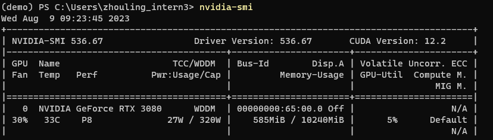
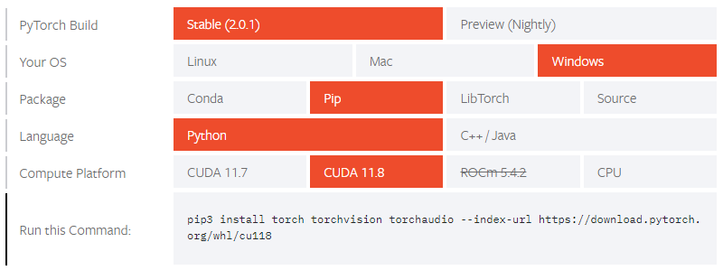

# GPU总结

本文总结如何在Windows下使用GPU给Pytorch程序进行加速。

1. 安装正确CUDA版本

2. 安装nvdcc正确版本

3. 安装正确的pytorch版本

## 1. 安装CUDA

在一开始可以使用`nvidia-smi`指令查看GPU有没有安装驱动，如果已经安装了驱动可以通过该指令看到目前CUDA的版本，如下图所示。在图中也可以看到目前已有的GPU型号和数量以及基本的使用情况。



目前CUDA的版本有12、11和10相对比较常用，通常来讲直接下载的GPU驱动中CUDA版本是最新的12版本。然而，Pytorch目前支持的CUDA版本为11.8一下，到CUDA10，为了保证软件的支持最好重新安装CUDA11.8或者11.7。而且不论`nvidia-smi`是否显示了正确的CUDA版本都最好重新安装一下CUDA。

CUDA官方的下载页面为：[CUDA Toolkit Archive | NVIDIA Developer](https://developer.nvidia.com/cuda-toolkit-archive)。在其中选择对应的版本下载安装即可。

**注意**：在安装好CUDA版本之后`nvidia-smi`显示出来的版本可能还是之前的版本，这个时候不要管nvidia-smi显示出来的版本，要在安装路径中找到是否存在自己刚刚安装的CUDA对应版本。这个问题在这里被详细讨论：[Different CUDA versions shown by nvcc and NVIDIA-smi - Stack Overflow](https://stackoverflow.com/questions/53422407/different-cuda-versions-shown-by-nvcc-and-nvidia-smi#:~:text=nvidia%2Dsmi%20shows%20the%20highest,installed%20at%20the%20same%20time.)

## 2. CUDNN安装

CUDNN为程序提供了深度学习所需的计算加速，例如高速卷积、激活等操作。为了能够使用pytorch的GPU版本需要安装对应版本的cudnn。目前下载CUDNN需要注册才能下载，注册完成之后下载对应的最新版本即可，例如CUDA为11.8那么CUDNN下载11.X的最新版本即可。

下载完成之后将CUDNN的压缩文件解压，放入对应的CUDA路径中即可。这个放入路径的过程较为复杂而且网上的说法不统一，因此这里采取Nvidia官方的说法[Installation Guide - NVIDIA Docs](https://docs.nvidia.com/deeplearning/cudnn/install-guide/index.html)。

## 3. 安装Pytorch

到这里安装Pytorch的过程已经非常简答， 只需要根据[Start Locally | PyTorch](https://pytorch.org/get-started/locally/)的官方教程选择合适的版本安装即可。举例来说之前安装的CUDA版本为11.8，因此这里使用如下的指令即可完成pytorch的安装：



全部安装完成之后使用如下指令检测pytorch是否支持CUDA：

```python
import torch
print(torch.cuda.is_available())
```

## 4. GPU效果

通常深度网络对比网络训练的时长使用一个epoch的时长，因此在这里对比训练2016年数据一个epoch使用GPU和CPU花费的时间长度。在统计中只统计训练过程中数据在深度神经网络中一个epoch所花费的时间，训练数据点个数为79632。对比结果如下：

|           | 使用pytorch           | 使用pytorch-cuda        |
| --------- | ------------------- | --------------------- |
| CPU型号     | Xeon Gold 6230（虚拟机） | 10920X 3.5GHz         |
| GPU型号     | 无                   | GeForce RTX 3080 10GB |
| epoch训练时间 | 211.0558（s）         | 1.87897634（s）         |
| 数据点数量     | 79632               | 79632                 |